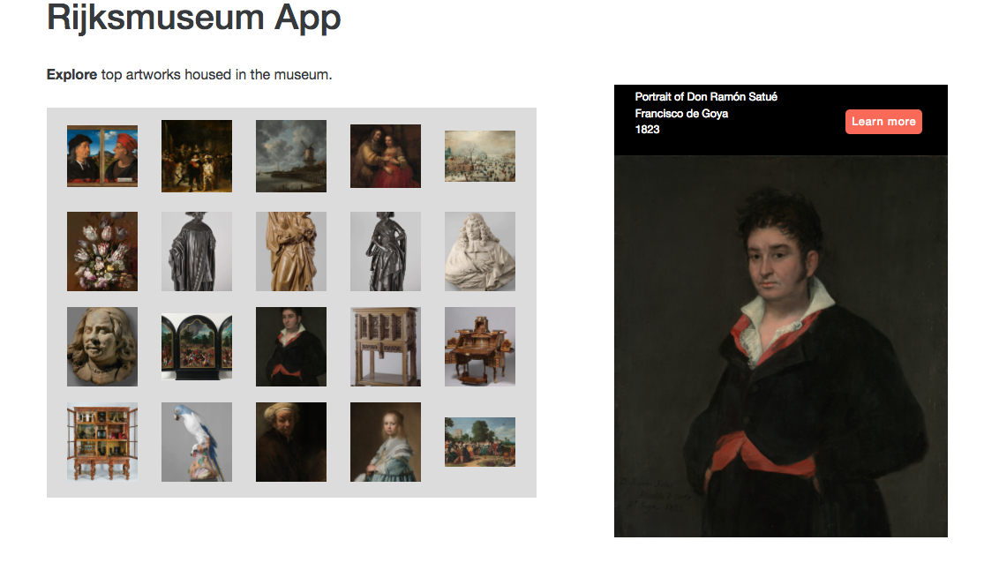

# Rijksmuseum App

Proof of concept for Belgard Products Pages:

* Pulling in large amounts of data
* Sorting and displaying data by keyword
* Showing a detail view of items

In progress...refactoring React/Redux app...



...refactoring React/Redux app...


React app. Completed project! Now, refactor for Redux. 


### Getting Started

There are two methods for getting started with this repo.

#### Git
Checkout this repo, install dependencies, then start the gulp process with the following:

```
> git clone https://github.com/StephenGrider/ReduxSimpleStarter.git
> cd ReduxSimpleStarter
> npm install
> npm start
```
