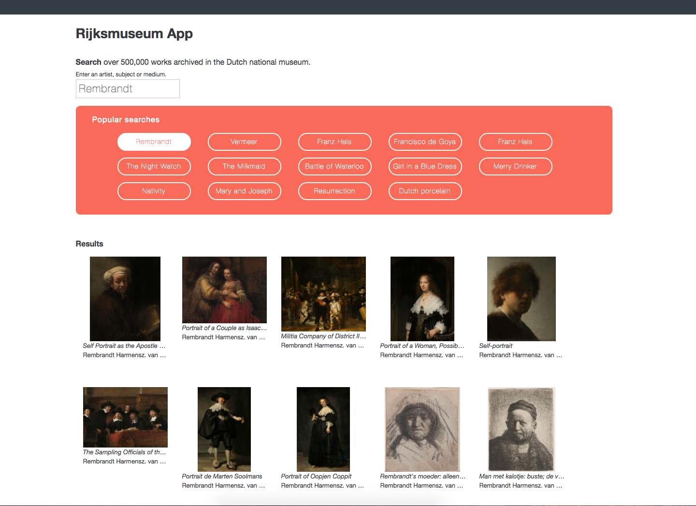

# Rijksmuseum App

Proof of concept for Belgard Products Pages:

* Pulling in large amounts of data
* Sorting and displaying data by keyword
* Showing a detail view of items

See the [app](https://oldcastleapg.github.io/redux_museum/) live. 



The objective of this exercise is to practice front end fundamentals, including:

* Ajax calls to a public API
* ReactJS state and props
* Redux state management

### Getting Started

There are two methods for getting started with this repo.

#### Git
Checkout this repo, install dependencies, then start the gulp process with the following:

```
> git clone https://github.com/StephenGrider/ReduxSimpleStarter.git
> cd ReduxSimpleStarter
> npm install
> npm start
```
