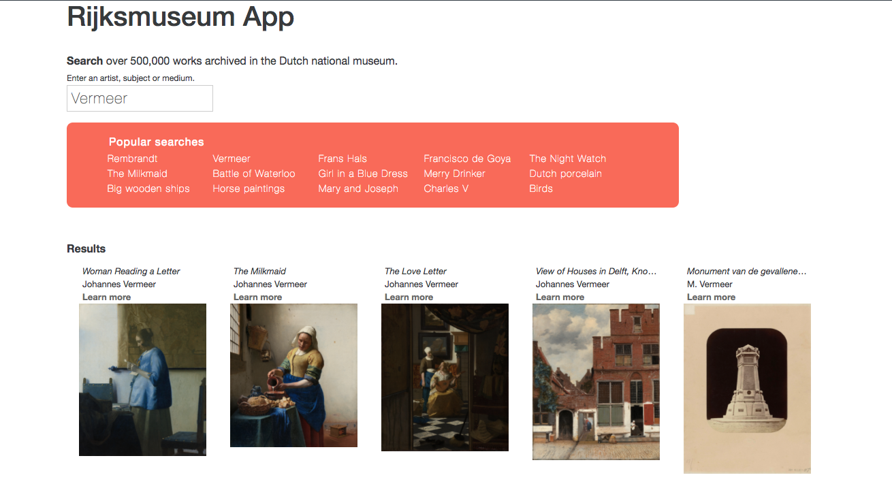
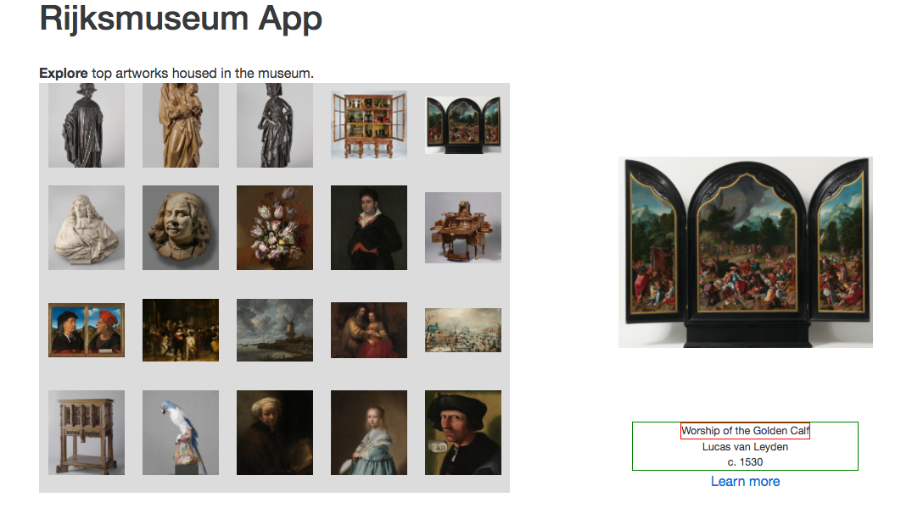

# Rijksmuseum App

Features:

* Pulls data from public API
* Saves data to Redux store & React components
* Sorts and displays data by search term
* Shows a detail view of items
* ES6 features: arrow functions, destructuring assignment, modules & template literals

Redux app. 




...refactor in progress.



React app. Completed project! Now, refactor for Redux. 


### Getting Started

There are two methods for getting started with this repo.

#### Git
Checkout this repo, install dependencies, then start the gulp process with the following:

```
> git clone https://github.com/StephenGrider/ReduxSimpleStarter.git
> cd ReduxSimpleStarter
> npm install
> npm start
```
